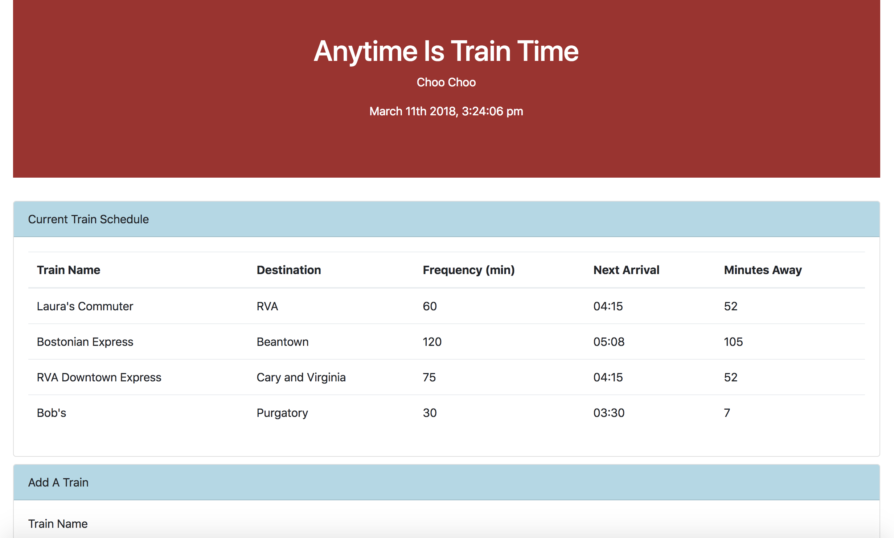
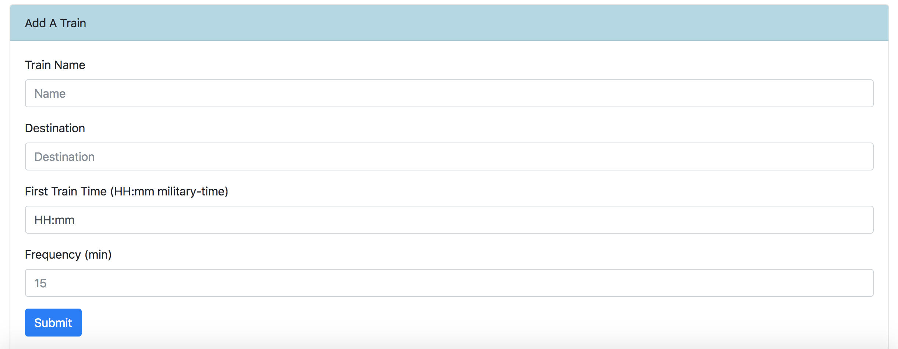
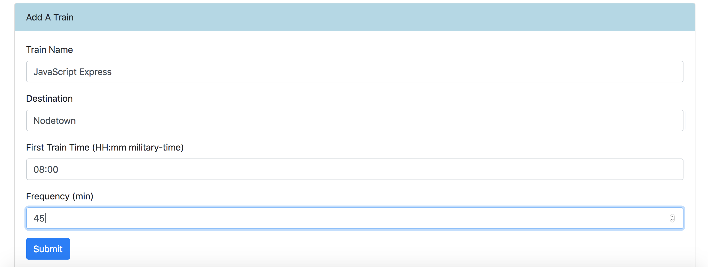
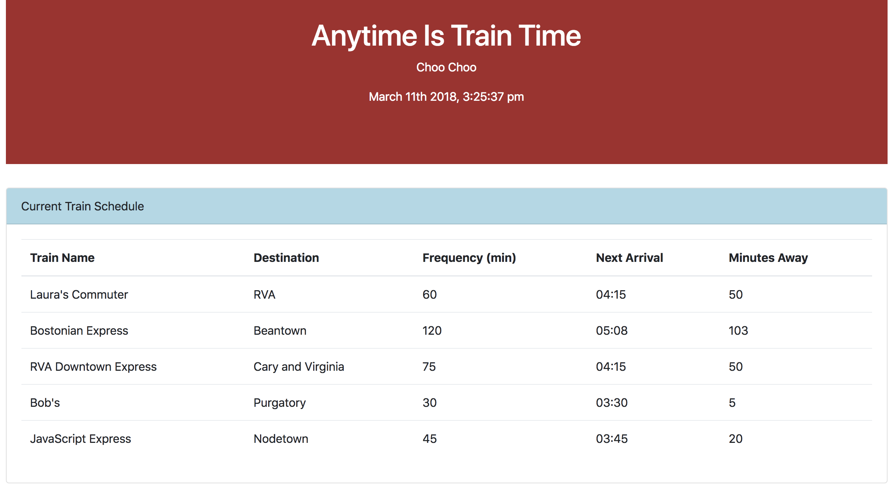

## TrainScheduler

# TrainScheduler is a train scheduling app that will tell you when your train is coming next. Using HTML, jQuery, Bootstrap, JavaScript, Moment.js, and Firebase, I've created an app that allows you to add a train to the scheduler and see when the next train is coming in!

